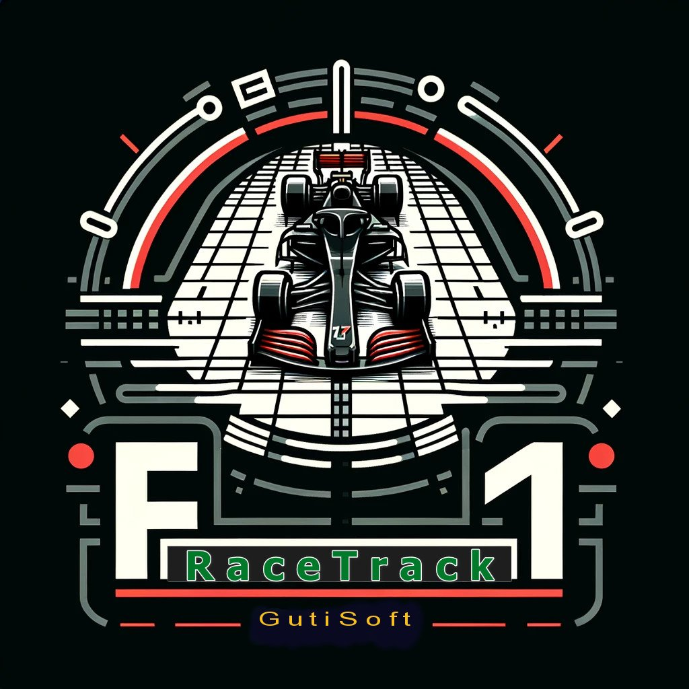

# F1-RaceTrack
F1-RaceTrack is a game that uses classic (Newtonian) mechanics to simulate an F1 car race.

Martin Gardner, a science communicator famous for his mathematical puzzles, described the mathematical game RACETRACK in Scientific American in the early 1970s as a new game for the intellect (not luck) https://link.springer.com/chapter/10.1007/978-3-642-13122-6_26 

It was played on a sheet of graph paper with colored pencils.

On a sheet of graph paper, a race track was drawn, and each player marked the initial location of their car at the starting line by drawing a point at the intersection of a grid.
Each car has a horizontal speed and a vertical speed (at the start of the game, both speeds are zero). To simulate acceleration, braking, and direction changes, on each turn, each player can change their horizontal speed by a maximum of one grid per turn, and can similarly change their vertical speed by a maximum of one grid per turn. 
The winner is the first player to safely cross the finish line. 

The game introduced concepts of speed, acceleration, and vector components.

A good description of the original game is available at:
https://en.wikipedia.org/wiki/Racetrack_(game)

F1-RaceTrack is a computer game that simulates and recreates the Racetrack game, with Formula 1 cars.

For more detailed information, read the instruction files in PDF format.

The launcher is the file: F1-RaceTrackEn.exe
____________________________________________________________________________________________________________

F1-RaceTrack es un juego que utiliza la mecánica clásica (newtoniana) para simular una carrera de coches de F1.

Martin Gardner, un comunicador científico famoso por sus acertijos matemáticos, describió el juego matemático RACETRACK en Scientific American a principios de los años 70 como un nuevo juego para el intelecto (no para la suerte) https://link.springer.com/chapter/10.1007/978-3-642-13122-6_26

Se jugaba en una hoja de papel cuadriculado con lápices de colores.

En la hoja de papel cuadriculado, se dibujaba una pista de carreras, y cada jugador marcaba la ubicación inicial de su coche en la línea de salida dibujando un punto en la intersección de una cuadrícula. Cada coche tiene una velocidad horizontal y una velocidad vertical (al comienzo del juego, ambas velocidades son cero). Para simular la aceleración, frenado y cambios de dirección, en cada turno, cada jugador puede cambiar su velocidad horizontal por un máximo de una cuadrícula por turno, y de manera similar puede cambiar su velocidad vertical por un máximo de una cuadrícula por turno. El ganador es el primer jugador en cruzar con seguridad la línea de meta.

El juego introdujo conceptos de velocidad, aceleración y componentes vectoriales.

Una buena descripción del juego original está disponible en: https://en.wikipedia.org/wiki/Racetrack_(game)

F1-RaceTrack es un juego para computadora que simula y recrea el juego Racetrack, con coches de Fórmula 1.

Para obtener información más detallada, lea los archivos de instrucciones en formato PDF.

Para lanzar el juega usar el fichero: F1-RaceTrackEs.exe
