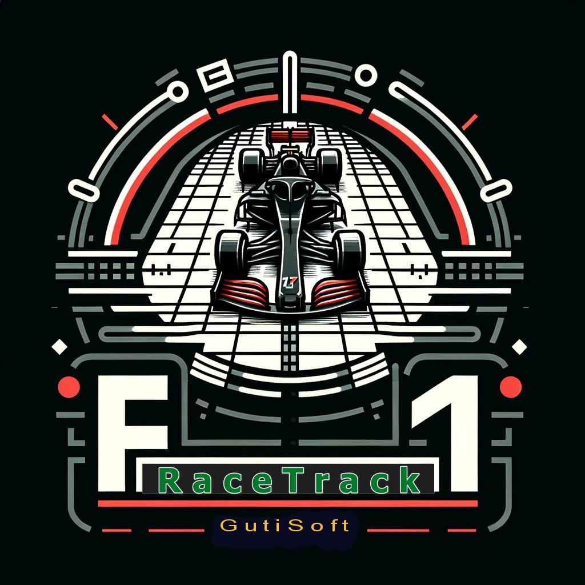

🇪🇸 Español
🎮 Jugar Última Versión
[https://f1-racetrack-game.duckdns.org/F1_Racetrack.html](https://f1-racetrack-game.duckdns.org/F1_Racetrack.html)
🧠 Origen
F1-RaceTrack es un juego que utiliza la mecánica clásica newtoniana para simular una carrera de coches de Fórmula 1.

Martin Gardner, un comunicador científico famoso por sus acertijos matemáticos, describió el juego matemático RACETRACK en Scientific American a principios de los años 70 como un nuevo juego para el intelecto, no para la suerte.

Referencia:
Martin Gardner - Racetrack

📝 Juego Original
El juego original se jugaba en una hoja de papel cuadriculado con lápices de colores.

Sobre la cuadrícula se dibujaba una pista de carreras, y cada jugador marcaba la posición inicial de su coche en la línea de salida dibujando un punto en una intersección de la cuadrícula.

Cada coche tiene:

Velocidad horizontal.
Velocidad vertical.
Velocidad inicial 0 en ambas direcciones.
En cada turno, cada jugador puede cambiar su velocidad horizontal como máximo en una unidad de cuadrícula, y también puede cambiar su velocidad vertical como máximo en una unidad de cuadrícula.

Esto simula:

Aceleración.
Frenado.
Cambios de dirección.
Movimiento vectorial.
El ganador es el primer jugador que cruza de forma segura la línea de meta.

Una buena descripción del juego original está disponible en:
Wikipedia - Racetrack game

🏁 F1-RaceTrack
F1-RaceTrack es un juego de ordenador que simula y recrea el juego clásico Racetrack con coches de Fórmula 1.

📖 Instrucciones
Para obtener información más detallada, lea los archivos de instrucciones en formato PDF.

⚙️ Conceptos Principales
Concepto	Descripción
Velocidad	El coche conserva su movimiento de un turno al siguiente.
Aceleración	La velocidad cambia gradualmente, una unidad por eje.
Vectores	El movimiento horizontal y vertical se gestionan por separado.
Estrategia	Ganar requiere planificar varios turnos por adelantado.
Física	El juego utiliza mecánica clásica newtoniana.

## 🇬🇧 English

### 🎮 Play Latest Version

[https://f1-racetrack-game.duckdns.org/F1_Racetrack.html](https://f1-racetrack-game.duckdns.org/F1_Racetrack.html)
🧠 Origin
F1-RaceTrack is a game that uses classic Newtonian mechanics to simulate a Formula 1 car race.

Martin Gardner, a science communicator famous for his mathematical puzzles, described the mathematical game RACETRACK in Scientific American in the early 1970s as a new game for the intellect, not for luck.

Reference:
Martin Gardner - Racetrack

📝 Original Game
The original game was played on a sheet of graph paper with colored pencils.

A race track was drawn on the grid, and each player marked the initial position of their car at the starting line by drawing a point at a grid intersection.

Each car has:

Horizontal speed.
Vertical speed.
Initial speed of 0 in both directions.
On each turn, each player can change their horizontal speed by a maximum of one grid unit, and can also change their vertical speed by a maximum of one grid unit.

This simulates:

Acceleration.
Braking.
Direction changes.
Vector movement.
The winner is the first player to safely cross the finish line.

A good description of the original game is available at:
Wikipedia - Racetrack game

🏁 F1-RaceTrack
F1-RaceTrack is a computer game that simulates and recreates the classic Racetrack game with Formula 1 cars.

📖 Instructions
For more detailed information, read the instruction files in PDF format.

⚙️ Core Concepts
Concept	Description
Speed	The car keeps its movement from turn to turn.
Acceleration	Speed changes gradually, one unit per axis.
Vectors	Horizontal and vertical movement are handled separately.
Strategy	Winning requires planning several turns ahead.
Physics	The game uses classic Newtonian mechanics.
